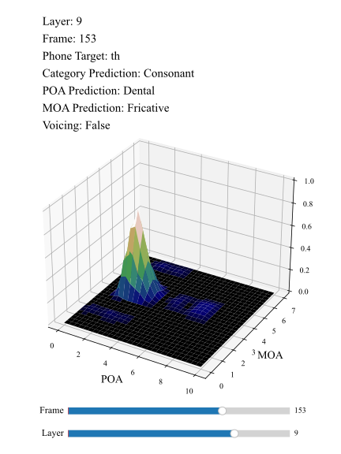
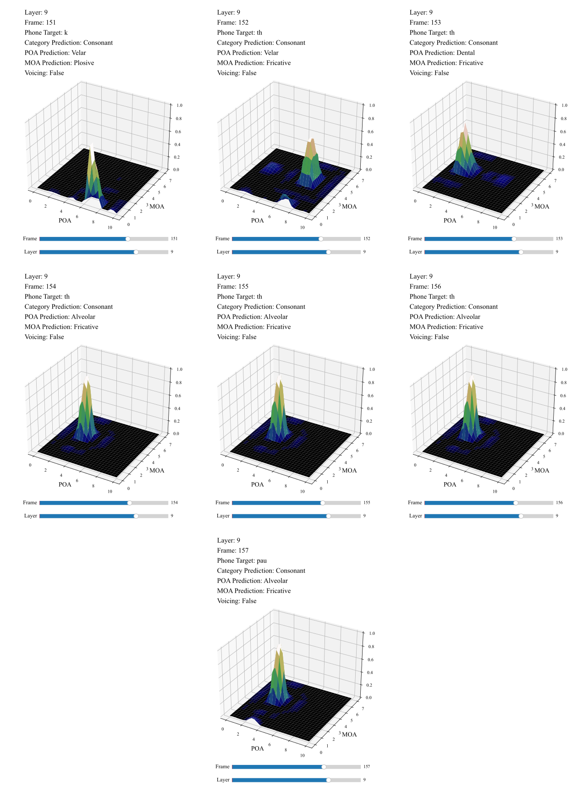

# WAV2VEC 2.0 Probe Visualizer (w2v2viz)
A visualizer tool based on phonetic articulatory feature probing on wav2vec 2.0 base model.
## Developers/Authors
![#000000] Patrick Cormac English, Erfan A. Shams, John D. Kelleher, Julie Carson-Berndsen

## Feature Mapping
Phonetic articulatory features are based on IPA charts (with ARPAbet notations) defined as follows:

| phone | cat | poa | moa | voicing | height | back | rounding |
|-------|-----|-----|-----|---------|--------|------|----------|
| b     | con | 0   | 0   | 1       | -      | -    | -        |
| d     | con | 3   | 0   | 1       | -      | -    | -        |
| g     | con | 7   | 0   | 1       | -      | -    | -        |
| p     | con | 0   | 0   | 0       | -      | -    | -        |
| t     | con | 3   | 0   | 0       | -      | -    | -        |
| k     | con | 7   | 0   | 0       | -      | -    | -        |
| dx    | con | 3   | 3   | 1       | -      | -    | -        |
| q     | con | 10  | 0   | 0       | -      | -    | -        |
| bcl   | sil | -   | -   | -       | -      | -    | -        |
| dcl   | sil | -   | -   | -       | -      | -    | -        |
| gcl   | sil | -   | -   | -       | -      | -    | -        |
| pcl   | sil | -   | -   | -       | -      | -    | -        |
| tcl   | sil | -   | -   | -       | -      | -    | -        |
| kcl   | sil | -   | -   | -       | -      | -    | -        |
| tck   | sil | -   | -   | -       | -      | -    | -        |
| jh    | con | 4   | 4   | 1       | -      | -    | -        |
| ch    | con | 5   | 4   | 0       | -      | -    | -        |
| s     | con | 3   | 4   | 0       | -      | -    | -        |
| sh    | con | 4   | 4   | 0       | -      | -    | -        |
| z     | con | 3   | 4   | 1       | -      | -    | -        |
| zh    | con | 4   | 4   | 1       | -      | -    | -        |
| f     | con | 1   | 4   | 0       | -      | -    | -        |
| th    | con | 2   | 4   | 0       | -      | -    | -        |
| v     | con | 1   | 4   | 1       | -      | -    | -        |
| dh    | con | 2   | 4   | 1       | -      | -    | -        |
| m     | con | 0   | 1   | 1       | -      | -    | -        |
| n     | con | 3   | 1   | 1       | -      | -    | -        |
| ng    | con | 7   | 0   | 0       | -      | -    | -        |
| em    | con | 0   | 1   | 1       | -      | -    | -        |
| en    | con | 3   | 1   | 1       | -      | -    | -        |
| eng   | con | 7   | 1   | 1       | -      | -    | -        |
| nx    | con | 3   | 3   | 1       | -      | -    | -        |
| l     | con | 3   | 7   | 1       | -      | -    | -        |
| r     | con | 3   | 2   | 1       | -      | -    | -        |
| w     | con | 1   | 6   | 1       | -      | -    | -        |
| y     | con | 6   | 6   | 1       | -      | -    | -        |
| hh    | con | 10  | 4   | 0       | -      | -    | -        |
| hv    | con | 10  | 4   | 1       | -      | -    | -        |
| el    | con | 3   | 7   | 0       | -      | -    | -        |
| iy    | vow | -   | -   | -       | 0      | 0    | 0        |
| ih    | vow | -   | -   | -       | 1      | 1    | 0        |
| eh    | vow | -   | -   | -       | 0      | 4    | 0        |
| ey    | vow | -   | -   | -       | 0      | 2    | 0        |
| ae    | vow | -   | -   | -       | 0      | 5    | 0        |
| aa    | vow | -   | -   | -       | 0      | 6    | 0        |
| aw    | vow | -   | -   | -       | 0      | 6    | 1        |
| ay    | vow | -   | -   | -       | 0      | 6    | 0        |
| ah    | vow | -   | -   | -       | 4      | 4    | 0        |
| ao    | vow | -   | -   | -       | 4      | 4    | 1        |
| oy    | vow | -   | -   | -       | 1      | 1    | 0        |
| ow    | vow | -   | -   | -       | 3      | 1    | 1        |
| uh    | vow | -   | -   | -       | 3      | 1    | 1        |
| uw    | vow | -   | -   | -       | 4      | 0    | 1        |
| ux    | vow | -   | -   | -       | 2      | 0    | 1        |
| er    | vow | -   | -   | -       | 1      | 1    | 0        |
| ax    | vow | -   | -   | -       | 2      | 3    | 0        |
| ix    | vow | -   | -   | -       | 2      | 0    | 0        |
| axr   | vow | -   | -   | -       | 1      | 1    | 0        |
| ax-h  | vow | -   | -   | -       | 2      | 3    | 0        |
| pau   | sil | -   | -   | -       | -      | -    | -        |
| epi   | sil | -   | -   | -       | -      | -    | -        |
| h#    | sil | -   | -   | -       | -      | -    | -        |
| 1     | sil | -   | -   | -       | -      | -    | -        |
| 2     | sil | -   | -   | -       | -      | -    | -        |

## A Sample from w2v2viz Visualzier

## Frame-wise Visualization of k-th Transition

## Layer-wise Visualization of a Single Frame

