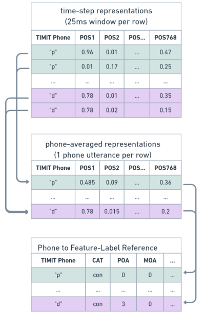

# WAV2VEC 2.0 Probe Visualizer (w2v2viz)
A visualizer tool based on phonetic articulatory feature probing on wav2vec 2.0 base model.

## Developers/Authors
Patrick Cormac English, Erfan A. Shams, John D. Kelleher, Julie Carson-Berndsen

## Publication
Following the Embedding: Identifying Transition Phenomena in Wav2vec 2.0 Representations of Speech Audio <br>
ICASSP 2024 - 2024 IEEE International Conference on Acoustics, Speech and Signal Processing (ICASSP)


## Methodology Diagram & Outline


## Data Preparation

We processed audio data from the TIMIT dataset using the wav2vec 2.0 model to generate embeddings for computational phonology analysis. The following steps were taken:

1. **Embedding Generation**: We ran the wav2vec 2.0 model on each .wav file from the TIMIT training and test datasets to produce embeddings. The model was configured to output hidden states of shape [13*N*768] for each file, where N represents the number of frames based on the audio length and 768 is the dimensionality of each embedding.

2. **Time-Step Representation**: Each [1*768] slice within the tensor corresponds to a 25ms frame of the speech signal with a 20ms stride. These time-step representations are consistent across all 12 transformer layers and the initial CNN output (layer 0).

3. **Phone Labelling**: Using TIMIT's time-aligned phonetic annotations, we mapped each time-step representation to its corresponding phone label. This was achieved by aligning the time-step positions in the [N*768] sequence with the TIMIT annotations.

4. **Test Set Separation**: We set aside 258,040 time-step samples from the TIMIT test set for evaluation purposes, as detailed in the upcoming probing task section.

## Data Processing and Labelling

For the training set, we implemented the following procedure:

1. **Phone-Averaged Representations**: Following a modified approach from Shah et al. (2021), we averaged the embeddings for each phone occurrence in the audio to create phone-averaged representations. This process resulted in 13 datasets (one for each layer) with 175,232 phone-averaged representations.

2. **Feature Annotation**: Each phone-averaged representation was annotated with feature labels for  phonetic features. These annotations were derived directly from the phone labels.

The same feature annotation method was applied to the 258,040 time-step representations from the TIMIT test set.


## Frame Aggregation and Feature Mapping Process
The aggregation process is done by averaging phones.



## Feature Mapping
Phonetic articulatory features are based on IPA charts (with ARPAbet notations) defined as follows:

| phone | cat | poa | moa | voicing |  back  |height| rounding |
|-------|-----|-----|-----|---------|--------|------|----------|
| b     | con | 0   | 0   | 1       | -      | -    | -        |
| d     | con | 3   | 0   | 1       | -      | -    | -        |
| g     | con | 7   | 0   | 1       | -      | -    | -        |
| p     | con | 0   | 0   | 0       | -      | -    | -        |
| t     | con | 3   | 0   | 0       | -      | -    | -        |
| k     | con | 7   | 0   | 0       | -      | -    | -        |
| dx    | con | 3   | 3   | 1       | -      | -    | -        |
| q     | con | 10  | 0   | 0       | -      | -    | -        |
| bcl   | sil | -   | -   | -       | -      | -    | -        |
| dcl   | sil | -   | -   | -       | -      | -    | -        |
| gcl   | sil | -   | -   | -       | -      | -    | -        |
| pcl   | sil | -   | -   | -       | -      | -    | -        |
| tcl   | sil | -   | -   | -       | -      | -    | -        |
| kcl   | sil | -   | -   | -       | -      | -    | -        |
| tck   | sil | -   | -   | -       | -      | -    | -        |
| jh    | con | 4   | 4   | 1       | -      | -    | -        |
| ch    | con | 4   | 4   | 0       | -      | -    | -        |
| s     | con | 3   | 4   | 0       | -      | -    | -        |
| sh    | con | 4   | 4   | 0       | -      | -    | -        |
| z     | con | 3   | 4   | 1       | -      | -    | -        |
| zh    | con | 4   | 4   | 1       | -      | -    | -        |
| f     | con | 1   | 4   | 0       | -      | -    | -        |
| th    | con | 2   | 4   | 0       | -      | -    | -        |
| v     | con | 1   | 4   | 1       | -      | -    | -        |
| dh    | con | 2   | 4   | 1       | -      | -    | -        |
| m     | con | 0   | 1   | 1       | -      | -    | -        |
| n     | con | 3   | 1   | 1       | -      | -    | -        |
| ng    | con | 7   | 1   | 1       | -      | -    | -        |
| em    | con | 0   | 1   | 1       | -      | -    | -        |
| en    | con | 3   | 1   | 1       | -      | -    | -        |
| eng   | con | 7   | 1   | 1       | -      | -    | -        |
| nx    | con | 3   | 1   | 1       | -      | -    | -        |
| l     | con | 3   | 7   | 1       | -      | -    | -        |
| r     | con | 3   | 6   | 1       | -      | -    | -        |
| w     | con | 1   | 6   | 1       | -      | -    | -        |
| y     | con | 6   | 6   | 1       | -      | -    | -        |
| hh    | con | 10  | 4   | 0       | -      | -    | -        |
| hv    | con | 10  | 4   | 1       | -      | -    | -        |
| el    | con | 3   | 7   | 0       | -      | -    | -        |
| iy    | vow | -   | -   | -       | 0      | 0    | 0        |
| ih    | vow | -   | -   | -       | 1      | 1    | 0        |
| eh    | vow | -   | -   | -       | 0      | 4    | 0        |
| ey    | vow | -   | -   | -       | 0      | 2    | 0        |
| ae    | vow | -   | -   | -       | 0      | 5    | 0        |
| aa    | vow | -   | -   | -       | 0      | 6    | 0        |
| aw    | vow | -   | -   | -       | 0      | 6    | 1        |
| ay    | vow | -   | -   | -       | 0      | 6    | 0        |
| ah    | vow | -   | -   | -       | 4      | 4    | 0        |
| ao    | vow | -   | -   | -       | 4      | 4    | 1        |
| oy    | vow | -   | -   | -       | 1      | 1    | 0        |
| ow    | vow | -   | -   | -       | 3      | 1    | 1        |
| uh    | vow | -   | -   | -       | 3      | 1    | 1        |
| uw    | vow | -   | -   | -       | 4      | 0    | 1        |
| ux    | vow | -   | -   | -       | 2      | 0    | 1        |
| er    | vow | -   | -   | -       | 1      | 1    | 0        |
| ax    | vow | -   | -   | -       | 2      | 3    | 0        |
| ix    | vow | -   | -   | -       | 2      | 0    | 0        |
| axr   | vow | -   | -   | -       | 1      | 1    | 0        |
| ax-h  | vow | -   | -   | -       | 2      | 3    | 0        |
| pau   | sil | -   | -   | -       | -      | -    | -        |
| epi   | sil | -   | -   | -       | -      | -    | -        |
| h#    | sil | -   | -   | -       | -      | -    | -        |
| 1     | sil | -   | -   | -       | -      | -    | -        |
| 2     | sil | -   | -   | -       | -      | -    | -        |

## A Sample from w2v2viz Visualzier


## Frame-wise Visualization of K-TH Transition


## Layer-wise Visualization of a Single Frame


### Cite as
```
@INPROCEEDINGS{10446494,
  author={English, Patrick Cormac and Shams, Erfan A. and Kelleher, John D. and Carson-Berndsen, Julie},
  booktitle={ICASSP 2024 - 2024 IEEE International Conference on Acoustics, Speech and Signal Processing (ICASSP)}, 
  title={Following the Embedding: Identifying Transition Phenomena in Wav2vec 2.0 Representations of Speech Audio}, 
  year={2024},
  volume={},
  number={},
  pages={6685-6689},
  keywords={Training;Data visualization;Speech recognition;Signal processing;Transformers;Feature extraction;Vectors;Speech Recognition;Phonetic Representations;Probing;Explainable AI},
  doi={10.1109/ICASSP48485.2024.10446494}}
```
